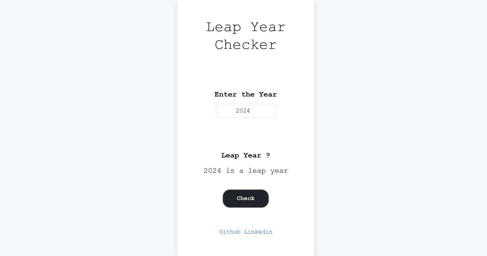

# 📅 Leap Year Checker Web App

This is a simple web application built using Flask that checks whether a given year is a leap year or not. The app receives input through an HTML form, sends the data to a Flask backend via AJAX, and displays the result dynamically on the web page.

## 🚀 Features
- Check if a year is a leap year.
- User-friendly interface with dynamic results.
- Backend logic handled by Flask.
- Frontend interaction with JavaScript and AJAX.

## 🖼️ Sample Screenshot


## 🛠️ Technologies Used
- **Backend**: Flask (Python)
- **Frontend**: HTML, CSS, JavaScript, jQuery
- **AJAX**: To handle asynchronous form submission

## 📂 Project Structure
```
Leap-Year-Checker/
│
├── app.py              # Flask application
├── templates/
│   └── app.html        # HTML frontend form
├── static/
│   └── style.css       # CSS for styling (optional)
├── README.md           # Project documentation
└── requirements.txt    # List of dependencies
```

## ⚙️ Installation and Setup
1. **Clone the repository:**
```
git clone <repository-url>
```
2. **Navigate to the project directory:**
```
cd Leap-Year-Checker
```
3. **Create a virtual environment (optional but recommended):**
```
python -m venv venv
source venv/bin/activate  # On Windows: venv\Scripts\activate
```
4. **Install dependencies:**
```
pip install -r requirements.txt
```

## Running the Application
1. **Start the Flask app:**
```
python app.py
```
2. **Open the app in your browser:**
```
http://127.0.0.1:5000/
```

## 📝 How to Use
1. Enter a year in the input field.
2. Click the "Check" button.
3. The app will display whether the year is a leap year or not.

## 📋 Example
- Input: **2024**
- Output: **2024 is a leap year**

- Input: **2023**
- Output: **2023 is not a leap year**


## ⚙️ Requirements
```
python 3.13.1
Flask
jquery
```

## Notes
- Ensure Flask and jQuery are installed and properly linked in your project.
- Customize the app.html file to improve UI/UX.
